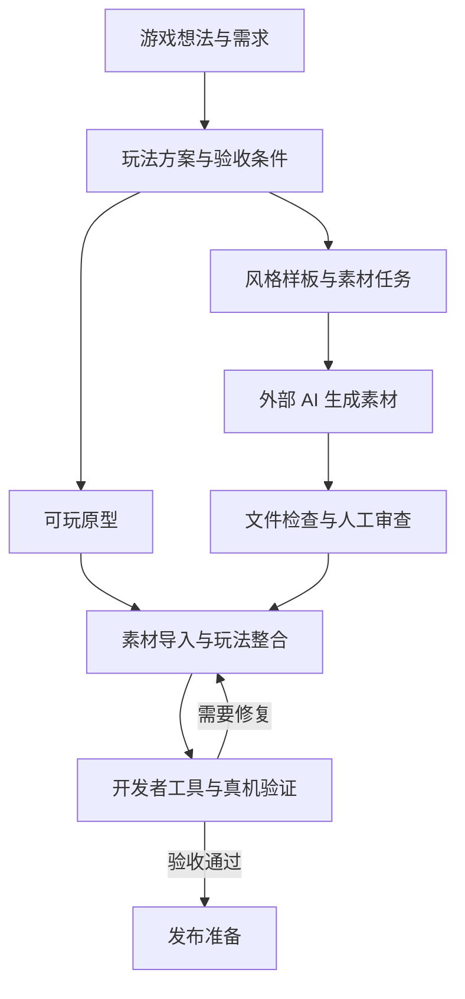

# 微信小游戏交付 Skill

> 从游戏想法出发，结合 AI 策划、美术与声音工具，完成原生微信小游戏的开发、素材整合、验证和发布准备。

这是一个面向 **Codex** 的微信小游戏开发 Skill。你可以用它整理玩法、搭建工程、实现交互、修复运行问题，也可以把其他 AI 网站生成的素材接入游戏。

当前已提供 **外部 AI 文件交接、素材检查、按版本导入和资源索引生成**。工具之外的画面审查、音效试听、微信开发者工具运行和真机验证，有各自的验收步骤。

[Skill 主入口](SKILL.md) · [外部 AI 协作指南](references/ai-collaboration.md) · [QA 清单](references/qa-checklist.md) · [发布指南](references/publishing.md)

## 适合哪些任务

- **从想法开始**：确定核心玩法、游戏范围、关卡数据与验收条件。
- **开发可玩原型**：搭建原生微信小游戏工程，用占位素材打通玩法和场景。
- **结合其他 AI**：生成素材提示词与交接清单，将下载的图片、声音或模型整理进工程。
- **调试与优化**：定位编译、资源加载、触摸交互、前后台恢复等问题，检查资源体积预算。
- **交付与发布准备**：记录验证结果，整理版本、隐私材料和发布检查项。

支持文字、休闲、动作、解谜和文化内容等游戏方向。轻量项目优先采用 CommonJS 与 Canvas2D；已有项目按实际技术栈处理。

## 游戏交付流程



策划、美术、声音和程序通过同一份游戏规格与素材清单衔接。先完成可玩原型，再逐步替换正式素材。

## 安装与开始使用

在 Codex 中输入：

```text
使用 $skill-installer 安装：
https://github.com/dandeshuitaleng-png/wechat-mini-game-delivery
```

也可以手动安装：

```bash
git clone https://github.com/dandeshuitaleng-png/wechat-mini-game-delivery.git \
  ~/.codex/skills/wechat-mini-game-delivery
```

已有同名目录时，先比较或备份。安装后在下一轮对话中使用 `$wechat-mini-game-delivery`。

### 整理一个游戏想法

```text
使用 $wechat-mini-game-delivery，把“方言声音配对”整理成
3 分钟内能完整通关的微信小游戏方案，先出方案，不写代码。
```

### 结合其他 AI 网站开发

```text
使用 $wechat-mini-game-delivery，结合我已有的 AI 网站制作知识答题小游戏。
生成策划交接包、统一美术风格、图片和声音任务及提示词。
先用占位素材制作可玩原型；我下载素材后，再检查、导入和整合。
```

### 修复已有游戏

```text
使用 $wechat-mini-game-delivery，检查这个项目在微信开发者工具中
读取关卡 JSON 失败的原因，修复后分别报告静态与运行验证结果。
```

## 如何与其他 AI 配合

| 环节 | 可配合的工具 | 交接成果 |
| --- | --- | --- |
| 策划与文案 | 用户已有的对话 AI | 玩法规则、关卡内容、文本与验收条件 |
| 界面与交互 | Figma 等设计工具 | 页面布局、状态与交互流程 |
| 图片素材 | 用户已有的生图网站，或 Scenario | 统一风格的角色、背景和道具 |
| 声音素材 | 用户已有的声音工具，或 ElevenLabs | 音效、配音及试听记录 |
| 3D 素材 | Meshy 等工具，按项目需要选择 | 模型文件及后续优化要求 |
| 工程整合 | Codex + 本 Skill | 资源索引、场景接入与检查报告 |

这些工具是可选项。**当前实现采用文件交接**：生成任务 → 在网站制作 → 下载文件 → 检查 → 导入游戏。供应商 API 适配器和网页自动操作尚未接入；服务能力、费用和使用条款以对应官方说明为准。

## 素材交接与导入

以下命令从 Skill 仓库根目录运行，需要 Node.js。实际项目请先修改[知识答题示例规格](examples/quiz-handoff.json)。

### 1. 生成协作包

```bash
node scripts/ai-handoff.js init examples/quiz-handoff.json /tmp/quiz-handoff-v1
```

生成：

- `brief.md`：核心循环、统一风格与验收条件。
- `prompts.md`：每项素材的提示词、路径与交付规格。
- `manifest.json`：素材清单、来源、版本与人工审查状态。

已有输出目录会拒绝覆盖，便于保留不同版本的任务。

### 2. 下载、检查与审查素材

将生成文件按清单路径放入暂存目录，例如 `/tmp/quiz-assets/images/mascot.png`。填写清单中的 `source`、`sourceReference`、`usageTerms` 和 `revision`，然后运行：

```bash
node scripts/ai-handoff.js check /tmp/quiz-handoff-v1/manifest.json /tmp/quiz-assets
```

工具检查路径、文件存在、体积预算和 PNG 文件头尺寸，并输出 SHA-256 指纹。首次检查会报告待审项目；打开图片、试听声音后设置 `reviewed: true`，将对应指纹填入 `reviewedSha256`，再重新检查。素材文件变更后需重新审查。

图片当前只支持 PNG 规格检查。完整图片解码、透明背景、音频时长、模型适用性和素材使用权需另外确认。

### 3. 预览并导入游戏

```bash
# 只预览，不写入工程
node scripts/ai-handoff.js import /tmp/quiz-handoff-v1/manifest.json /tmp/quiz-assets /path/to/game v1

# 核对当前审查指纹后，创建新版本目录
node scripts/ai-handoff.js import /tmp/quiz-handoff-v1/manifest.json /tmp/quiz-assets /path/to/game v1 --apply
```

目标需含 `compileType: game` 的 `project.config.json`；当前不支持嵌套 `miniprogramRoot`。导入生成：

```text
ai-assets/v1/
├── images/、audio/ 等素材路径
├── index.js       # CommonJS 资源索引
└── receipt.json   # 来源、版本与文件指纹
```

已有版本拒绝覆盖。新版可使用 v2，回退时将代码引用切回 v1。工具负责导入文件，Codex 继续接入实际场景的加载、失败回退与绘制逻辑。保留的旧版本会增加包体，发行前需检查实际引用与资源预算。

详细规则和代码接入示例见[外部 AI 协作指南](references/ai-collaboration.md)。

## 工作模式

| 模式 | 用途 |
| --- | --- |
| Ideate | 收敛游戏想法与玩法范围 |
| Plan | 整理技术方案、数据结构与验收条件 |
| Collaborate | 拆分外部 AI 任务，交接、检查和导入素材 |
| Build | 新建或修改工程，实现游戏功能 |
| Debug | 复现并修复编译或运行问题 |
| Optimize | 改善性能、包体与体验 |
| QA | 检查并报告问题，修改需在授权范围内 |
| Publish | 准备版本、隐私材料与发布清单 |

## 内置工具

| 脚本 | 作用 |
| --- | --- |
| [`init-project.js`](scripts/init-project.js) | 创建 basic、canvas2d 或 subpackage 模板 |
| [`ai-handoff.js`](scripts/ai-handoff.js) | 生成协作包、检查素材、预览与执行版本导入 |
| [`validate-assets.js`](scripts/validate-assets.js) | 检查工程必需文件、配置与大文件风险 |
| [`check-performance.js`](scripts/check-performance.js) | 估算源码与资源体积预算，提示常见风险 |
| [`audit-word-levels.js`](scripts/audit-word-levels.js) | 检查文字游戏关卡、路径与目标词 |

```bash
node scripts/init-project.js my-game --template canvas2d
node scripts/validate-assets.js /path/to/my-game
node scripts/check-performance.js /path/to/my-game
node scripts/audit-word-levels.js data/levels.json --directions 8 --expected-levels 30 --strict
```

包体工具统计 JSON、字体等文件，排除 `.git`、`node_modules` 和项目工具配置；尚未应用 `packOptions` 或编译转换，最终包体以开发者工具为准。该工具不测量帧率、内存或加载耗时。

## 验证与交付

| 证据 | 确认内容 |
| --- | --- |
| 静态 | 源码、配置、数据与文件检查结果 |
| 构建 | 微信开发者工具实际编译结果 |
| 运行 | 游戏启动且无阻断错误 |
| 交互 | 点击、滑动、暂停、恢复与异常路径 |
| 视觉与声音 | 当前版本截图、素材显示与实际试听 |
| 性能 | 真机帧率、内存、加载时间与最终包体 |

文件导入通过后仍需继续验证游戏。微信开发者工具、AppID、平台账号和真机环境按项目配置；发布前核对当前平台规则并完成 iOS 与 Android 真机验证。

本 Skill 面向原生微信小游戏。第三方素材和代码需核对使用授权；账号密钥留在本地环境或服务端，不写入 Git、素材清单或小游戏客户端。

## 仓库导航与开发验证

- [`SKILL.md`](SKILL.md)：主入口与任务路由。
- [`agents/openai.yaml`](agents/openai.yaml)：Codex 展示信息。
- [`references/`](references/)：策划、游戏类型、设计、调试、协作、QA 与发布指南。
- [`examples/`](examples/)：可修改的素材交接规格。
- [`scripts/`](scripts/)：工程与交接工具。
- [`tests/`](tests/)：工具行为的回归验证。

修改工具后运行：

```bash
node tests/smoke.cjs
node tests/ai-handoff.cjs
```

测试覆盖工程生成、目录保护、模拟场景绘制与前后台恢复，以及素材检查、指纹绑定、导入预览、版本保护和路径约束。模拟测试不代表微信开发者工具或真机验收通过。
